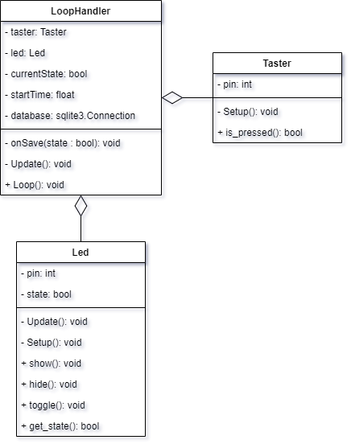
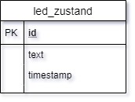

# LED und Taster

Eine Aufgabe um die Grundlagen
 * der Programmierung eines Tasters und einer Leuchtdioden
 * einer Datenbank
 * einer Implentierung von einer Datenbank(sqlite) in Python-Quellcode
zu wiederholen. 

**Schüler: CO**

**Klasse: ITA18a**

## Aufgabe
Planen und Realisieren Sie eine Schaltung bestehend aus einer LED (mit Vorwiderstand) und einem Taster (mit Pull-down-Widerstand) an GPIO-Pins des Raspberry Pi. Die Anwendung soll wie folgt funktionieren:
* Wird der Taster kurz betätigt, wird die LED eingeschaltet und ein Zeitstempel und der Zustand der LED in einerDatenbanktabelle hinterlegt
* Wird der Taster ein zweites Mal kurz betätigt, wird die LED wieder ausgeschaltet. Auch hier erfolgtein Eintrag in der Datenbank. 
* Wird der Taster dauerhaft betätigt, so ändert sich der Zustand der LED nicht. 

## Lösung
### Klassendiagramme

### ER-Modell

### Quellcode
'''python

'''
[Quellcode](exercise01.py)
[Datenbank](setup.sql)

[Technische Berufliche Schule 1](http://tbs1.de/jcms/index.php)
